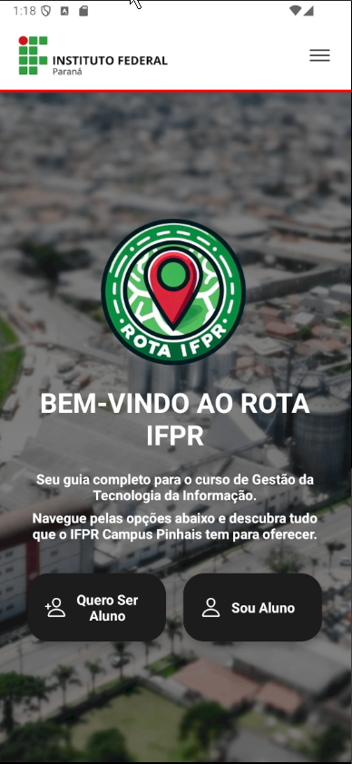
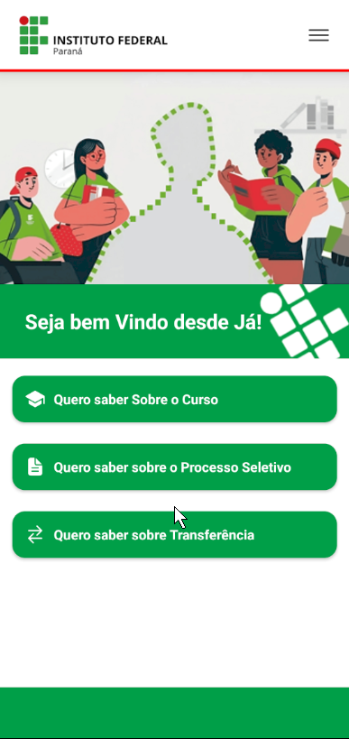
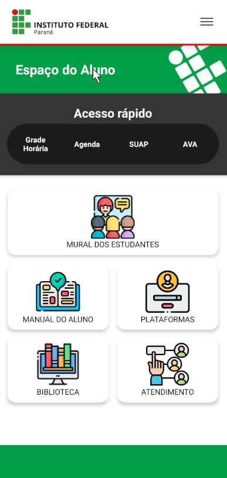
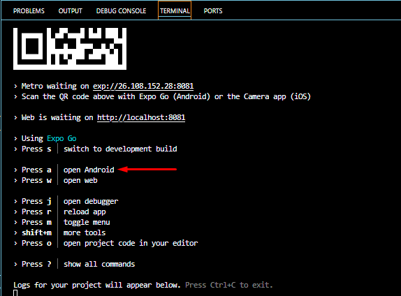

# 📱 Rota IFPR Mobile

Aplicativo mobile criado para facilitar a **localização de setores e salas** dentro do campus do Instituto Federal do Paraná (IFPR). O app tem como objetivo ajudar alunos e visitantes a otimizarem seu tempo de deslocamento.

---

## 🚀 Funcionalidades

- 🔍 Fácil acesso a informação fornecida pelo polo Cãmpus Pinhais do IFPR
- 🗺️ Orientações para pessoas que querem ser Estudantes de GTI (Gestão da Tecnologia da Informação)
- 🎓 Interface amigável e pensada para estudantes
- 📌 Chat para Estudantes do IFPR Campus Pinhais

---

## 🛠️ Tecnologias utilizadas

- [React Native](https://reactnative.dev/)
- [Expo](https://expo.dev/)
- [Expo Router](https://expo.github.io/router/)
- [Firebase](https://firebase.google.com/)
- [TypeScript](https://www.typescriptlang.org/)

---

## 📷 Demonstração






---

## ⚙️ Como rodar o projeto

### Pré-requisitos
- Node.js
- Expo CLI (`npm install -g expo-cli`)
- Editor de código (VSCode recomendado)


### Instalação


```bash
# Clone o repositório
git clone https://github.com/Zn1291/Rota-IFPR_Mobile.git

# Acesse a pasta
cd Rota-IFPR_Mobile

# Instale as dependências
npm install

# Rode o app com Expo
npx expo start

#Sugestão de Emulador Android Studio

## 👨‍👩‍👧‍👦 Autores
- **Alessandro Sondey Rodrigues Lima** – [GitHub](https://github.com/Al3s4ndr0) • [LinkedIn](https://www.linkedin.com/in/alessandrosondey/)
- **Milena Pianaro** – [GitHub](https://github.com/milenapianaro) • [LinkedIn](https://www.linkedin.com/in/milenapianaro/)
- **Leandro Zeni** – [GitHub](https://github.com/Zn1291) • [LinkedIn](https://www.linkedin.com/in/leandrozeni/)